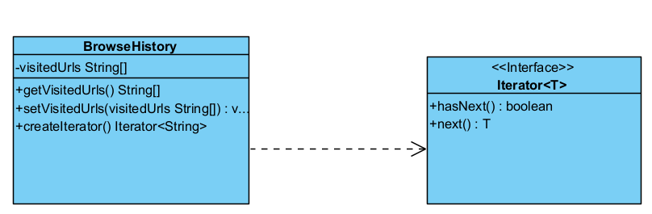

## iterator pattern
### main purpose of this pattern is traverse through collection of data . or The Iterator pattern allows us to access the elements of a collection sequentially without exposing its underlying representation

iterator defined by GOF :

Provides a way to access the elements of an aggregate object without exposing its underlying represenation.

idea of iterator pattern . we iterate on class base on specified attribute.

if we change attribute structure or type is effected on consumers but if we used with iterator patter is break inside class
and handled inside class and don't impact on consumers

changing the internal of object should not affect on consumers

in this example we use browseHistory and store list of url visited
if we in future use array or queue instead of list that impact on consumers

but also if change in browseHistory only must break inside class not consumers

## note : use iterator method in interface rather than inside class.
we are able to use hasNext() and next() method on class but by consideration solid principle
class must have single responsibility. for example in browseHistory class we can to add hasNext() and next() method to this class
but is not responsibility of this class . also maybe we want to have different implementation such as list , queue , array and so on
then **_iterator functionality is better to be interface_**

## when we use iterator pattern
<ul>
    <li>need for sequential access:  
    
use the Iterator pattern when you need to access elements of a collection sequentially without exposing its underlying representation

</li>
    <li>
    Support for multiple iterators:  
    
use the Iterator pattern when you need to support multiple iterators over the same collection. Each iterator maintains its own iteration state, allowing multiple iterations to occur concurrently.

</li>
    <li>
    Simplifying client code:  
    
clients only need to interact with the iterator interface, abstracting away the complexity of the collection’s internal structure.

</li>
</ul>

### useful link : https://www.digitalocean.com/community/tutorials/iterator-design-pattern-java
