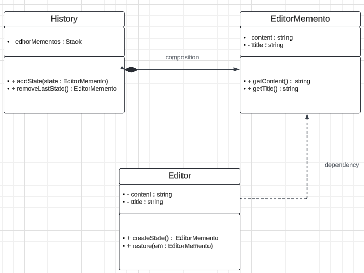

there is uml diagram for Editor example with memento pattern

in this pattern we use 
<ul>
    <li>originator</li>
    <li>memento</li>
    <li>caretaker</li>
</ul>

this pattern usually used we want keep track different state of program

in this pattern designed we 3 different class

also we are able to design only with History & Editor
but in History(caretaker) we has direct access to field of originator and violate encapsulation

The Caretaker's role is simplified because it only needs to manage Memento objects rather than dealing directly with the Originator's internal state. 

also if originator need to be changed we use memento in history and no worries.