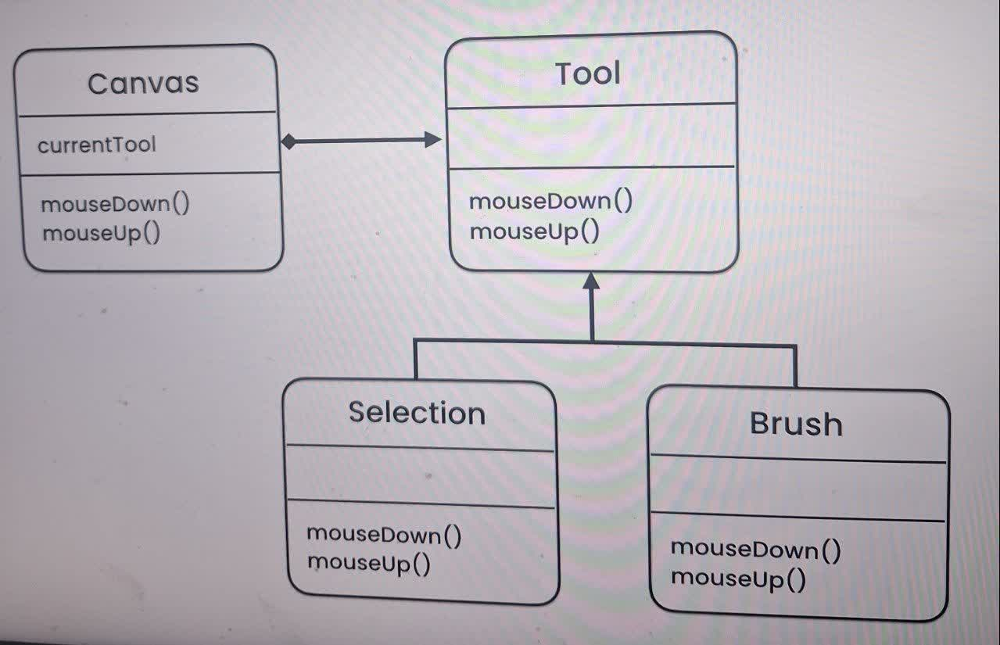

state design pattern. 

primary goal of this pattern is allow behaviour differently 
base on the state

state1 -> behaviour1
state2 -> behaviour2
state3 -> behaviour3

2 reason we use this pattern

1. whenever we have some behaviour on different piece of code 
2. whenever in future we need change to code for add new feature. this violates extensibility 
