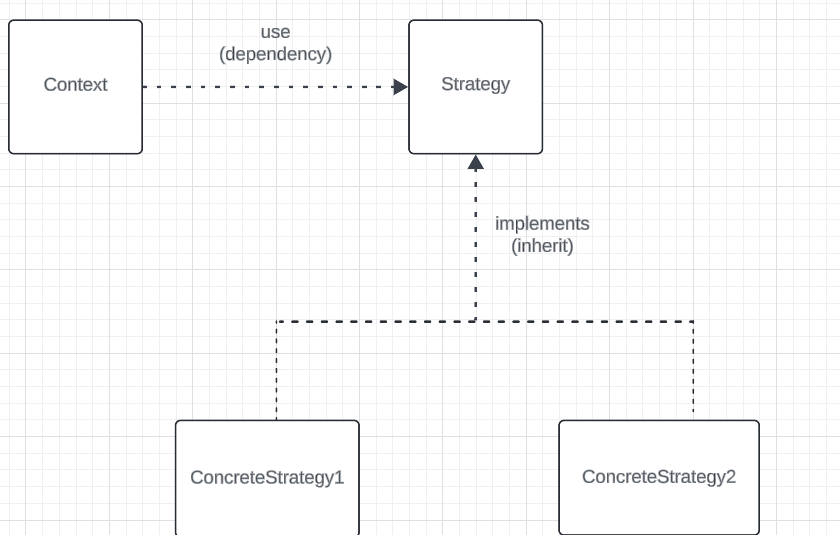

## strategy pattern

The Strategy pattern is used to define a family of algorithms, encapsulate each one, and make them interchangeable. It allows a client to choose which algorithm to use at runtime.

use case : You might use the Strategy pattern when you have multiple ways to perform a task and you want to switch between them easily (e.g., different sorting algorithms).

this pattern is very similar to state pattern with key differences

## in strategy pattern we use different way to perform task and switch between them. but in state pattern we use different behaviour base on changing state

example : suppose we have class called SortingAlgorithm and method of sort with argument of sortName and array
we have different type of sorting such as bubble sort and heap sort merge sort and quick sort
we call different implementation base on sortType.

key difference between state & strategy : 
## in strategy pattern we behaviour differently base on client decision. but also we do same work in different way for example sorting or hashing in different way
but in state pattern . we do different work base on state changed.

## very important note
> <em> <strong>"In the Strategy pattern, we perform the same task in different ways based on the client's decision, such as using different sorting or hashing algorithms. In contrast, the State pattern allows us to perform different behaviors based on changes in the object's state." </strong></em>

>em . state pattern is abbreviation of state machine . suppose we have graph with node and edge
> state equal node and edge is related behaviour. suppose with state of brush(node) we can draw(edge) and go to new state (line)  
> Strategy patterns allow having multiple implementation of one algorithm.

> Purpose:

Strategy Pattern: Encapsulates algorithms for a specific task, allowing the context to choose which algorithm to use at runtime.
State Pattern: Manages state-dependent behavior, allowing an object to change its behavior when its internal state changes.

> Behavior Control:

Strategy: The behavior is determined externally by the context.
State: The behavior is determined internally by the state of the object.

> State Transition:

Strategy: Does not manage state; it simply defines different ways to perform a task.
State: Manages transitions between different states, often with rules for when transitions occur.

example of strategy pattern 
 > interface PaymentStrategy {  
 &nbsp;&nbsp;&nbsp;void pay(int amount);  
 }

// Concrete Strategies

> class CreditCardPayment implements PaymentStrategy {  
&nbsp;&nbsp;&nbsp;public void pay(int amount) {  
&nbsp;&nbsp;&nbsp;&nbsp;&nbsp;&nbsp;System.out.println("Paid " + amount + " using Credit Card.");
   
> &nbsp;&nbsp;&nbsp;&nbsp;}  
}

> class PayPalPayment implements PaymentStrategy {  
&nbsp;&nbsp;&nbsp;public void pay(int amount) {  
&nbsp;&nbsp;&nbsp;&nbsp;&nbsp;&nbsp;System.out.println("Paid " + amount + " using PayPal.");   &nbsp;&nbsp;&nbsp;
}  
}

// Context
> class ShoppingCart {  
&nbsp;&nbsp;&nbsp;private PaymentStrategy paymentStrategy;   
&nbsp;&nbsp;&nbsp;public void setPaymentStrategy(PaymentStrategy paymentStrategy) {  
&nbsp;&nbsp;&nbsp;&nbsp;&nbsp;&nbsp;this.paymentStrategy = paymentStrategy;   &nbsp;&nbsp;&nbsp;
    }  
&nbsp;&nbsp;&nbsp;   public void checkout(int amount) {  
&nbsp;&nbsp;&nbsp;&nbsp;&nbsp;&nbsp;paymentStrategy.pay(amount);   &nbsp;&nbsp;
    }  
}

// Usage
>public class Main {
public static void main(String[] args) {    
&nbsp;&nbsp;&nbsp;ShoppingCart cart = new ShoppingCart();  
&nbsp;&nbsp;        // Pay with credit card  
&nbsp;&nbsp;       cart.setPaymentStrategy(new CreditCardPayment());  
&nbsp;&nbsp;        cart.checkout(100);   
&nbsp;&nbsp;       // Change payment method to PayPal  
&nbsp;&nbsp;        cart.setPaymentStrategy(new PayPalPayment());  
&nbsp;&nbsp;       cart.checkout(150);   &nbsp;&nbsp;
    }  
}

example of state pattern

> interface TrafficLightState {  
&nbsp;&nbsp;&nbsp;void change(TrafficLight context);  
}

// Concrete States
> class RedState implements TrafficLightState {  
&nbsp;&nbsp;&nbsp;public void change(TrafficLight context) {   
&nbsp;&nbsp;&nbsp;&nbsp;&nbsp;&nbsp;&nbsp;System.out.println("Traffic light is Red. Cars must stop.");  
&nbsp;&nbsp;&nbsp;&nbsp;&nbsp;&nbsp;&nbsp;context.setState(new GreenState());   &nbsp;&nbsp;
}  
}

>class GreenState implements TrafficLightState {  
&nbsp;&nbsp;&nbsp;&nbsp;public void change(TrafficLight context) {  
&nbsp;&nbsp;&nbsp;&nbsp;&nbsp;&nbsp;&nbsp;&nbsp;System.out.println("Traffic light is Green. Cars can go.");  
&nbsp;&nbsp;&nbsp;&nbsp;&nbsp;&nbsp;&nbsp;&nbsp;context.setState(new YellowState());   &nbsp;&nbsp;
}  
}

>class YellowState implements TrafficLightState {  
&nbsp;&nbsp;&nbsp;&nbsp;public void change(TrafficLight context) {  
&nbsp;&nbsp;&nbsp;&nbsp;&nbsp;&nbsp;&nbsp;&nbsp;System.out.println("Traffic light is Yellow. Cars should prepare to stop.");
&nbsp;&nbsp;&nbsp;&nbsp;&nbsp;&nbsp;&nbsp;&nbsp;context.setState(new RedState());   &nbsp;&nbsp;&nbsp;&nbsp;
}  
}

// Context           

    class TrafficLight {

       private TrafficLightState state;

       public TrafficLight() {
          state = new RedState(); // Initial state
       }

       public void setState(TrafficLightState state) {
         this.state = state;
       }

       public void change() {
         state.change(this);
       }
    }

// Usage
    
    public class Main {

       public static void main(String[] args) {
          TrafficLight trafficLight = new TrafficLight();
       // Simulate traffic light changes
        
          for (int i = 0; i < 6; i++) {
             trafficLight.change();
        }
    }
}
> Summary : 
Strategy Pattern: The ShoppingCart can switch payment methods at any time, demonstrating flexibility in how it processes payments.
State Pattern: The TrafficLight automatically changes its behavior based on its current state (Red, Green, Yellow), showing how it adapts without external input.

very short key differences between that ->

> #Key Differences
##State Pattern:

<strong>Internal State Management</strong>: The object’s behavior changes automatically based on its internal state. The object knows its current state and adjusts its behavior accordingly.
Automatic Transitions: The transitions between states happen within the object itself, often based on its internal logic.
Example: A TrafficLight changes from Red to Green automatically based on time or conditions without external intervention.

##Strategy Pattern:

<strong> External Decision Making </strong>: The object (context) selects a strategy based on external conditions or inputs. The context chooses which behavior to apply.
No Internal State Management: The strategies do not manage their own state; they simply perform a task as instructed by the context.
Example: A ShoppingCart chooses a payment method based on user selection (Credit Card, PayPal), but it does not manage any internal state.

## Summary
So, in essence:

State: Behavior is driven by the internal state of the object, leading to automatic transitions.
Strategy: Behavior is chosen externally by the context, based on conditions or user input.

### useful link : https://medium.com/@iamprovidence/strategy-vs-state-pattern-6168cc102c91
