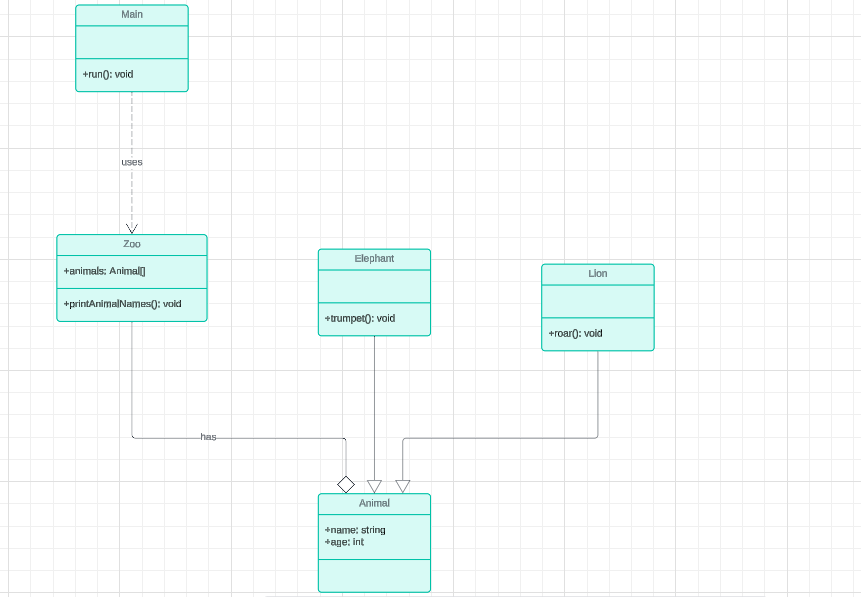

in uml ( unified model language) we have 3 different type of relation between classes . <b style="color:purple">inheritance</b> <b style="color:orange">composition & aggregation</b>. <b style="color:grey">dependency</b>

suppose we have base class called Animal with different attribute such as name , age and two different subclass called Lion & Elephant -
and defined another class called Zoo with attribute of List of Animal and we have method printAnimalNames

we use Zoo Object in Main class

